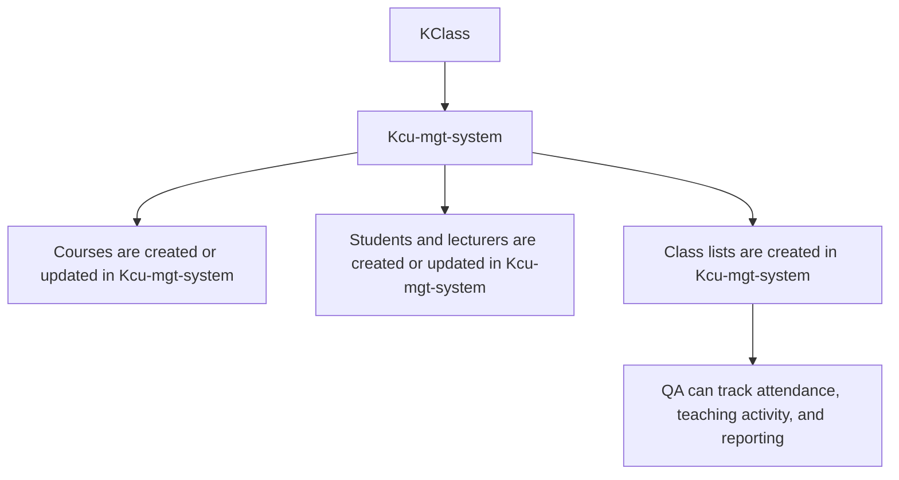
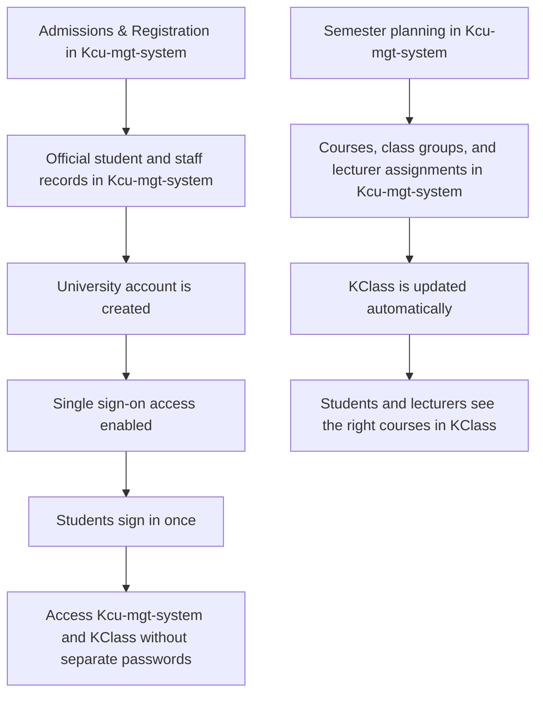
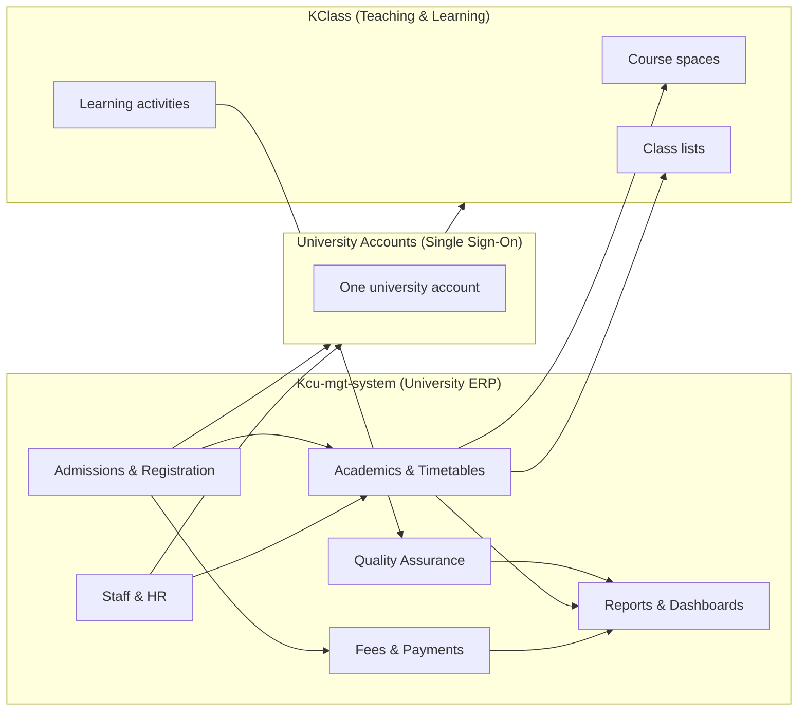
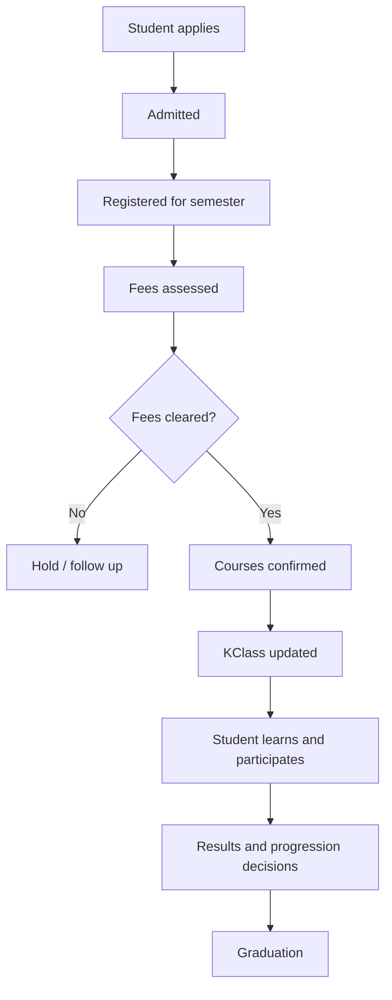
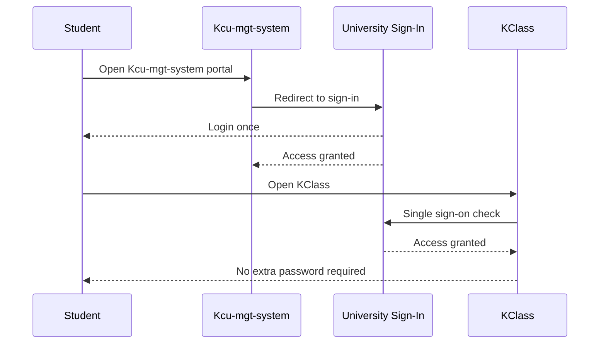
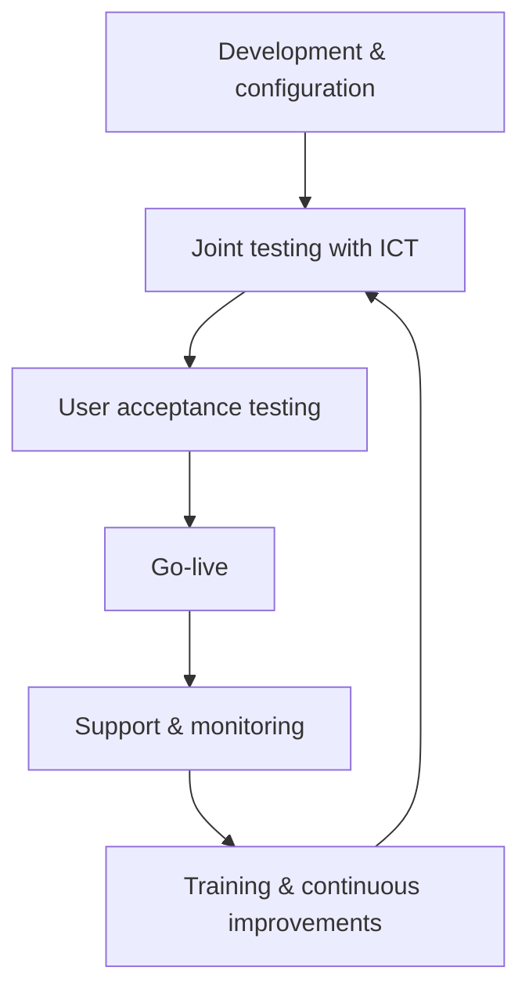

# Kcu-mgt-system — Flow Overview (Non-Technical)

This document explains, in simple terms, how Kcu-mgt-system currently works with KClass and how it will evolve into a full University Management System (ERP) that supports the whole student lifecycle.

It is written for both technical and non-technical readers.

## Part 1: Current flow (today) — KClass → Kcu-mgt-system

### What is happening now

Today, Kcu-mgt-system is mainly supporting the Quality Assurance (QA) office. To help QA work accurately, Kcu-mgt-system **pulls information from KClass** so that:

- Courses can be listed in Kcu-mgt-system,
- Students and lecturers can be identified in Kcu-mgt-system,
- Class lists (who belongs to which course) are available for QA tracking and reporting.

### What information we pull

- **Courses**: what is being taught
- **People**: students and lecturers involved in those courses
- **Class lists**: which students are associated with which courses

### High-level flow diagram (today)

### Why this matters for QA

When QA needs to track teaching and attendance, they need a reliable list of:

- Which courses exist,
- Which lecturer is attached to a course,
- Which students belong to the course.

By pulling this from KClass, Kcu-mgt-system can start QA operations faster and reduce manual data entry.

## Part 2: Target flow (future) — Kcu-mgt-system ERP → KClass (with Single Sign-On)

### What we are building towards

The long-term goal is for Kcu-mgt-system to become a **full University Management System (ERP)** that manages the official university data such as:

- Admissions and registration,
- Student and staff records,
- Programmes and courses,
- Semester planning and timetables,
- Fees and payments,
- Quality assurance workflows,
- Reporting and decision support.

In this model:

- **Kcu-mgt-system is the main source of truth** (official records),
- KClass is used mainly for **teaching and learning** (course materials, activities, learning progress).

### The goal for student experience (no repeated logins)

Students and staff should have:

- **One university account**, and
- **One sign-in** to access both Kcu-mgt-system and KClass.

This is commonly achieved through **Single Sign-On (SSO)**.

### High-level flow diagram (future)

## The University-wide structure we will follow (ERP blueprint)

Below is the practical structure to guide future development.

### University-wide structure diagram (future)

### A. Student lifecycle

- Applications and admissions
- Registration and enrolment each semester
- Progression, graduation, and transcripts

### B. Academic operations

- Schools, departments, programmes
- Course catalogue and course offerings per semester
- Timetables and lecturer allocations

### C. Teaching and learning (KClass)

- Course materials and activities
- Learning participation and engagement
- (Optional later) return of final results/grades into Kcu-mgt-system where required

### D. Finance

- Student billing and payments
- Fee balances and receipts
- Holds and clearance processes

### E. Staff and HR support

- Staff records, departments, responsibilities
- Teaching load and assignments

### F. Quality Assurance and reporting

- Lecture tracking and monitoring
- Attendance and performance insights
- Reports for management and compliance

### Student journey diagram (future)

### How learning access works (future: one sign-in)

### Implementation & handover diagram (ICT collaboration)

## Summary

- **Today**: Kcu-mgt-system pulls courses, people, and class lists from KClass to support QA work.
- **Future**: Kcu-mgt-system becomes the main University ERP and updates KClass automatically, with a single sign-on experience for students and staff.

